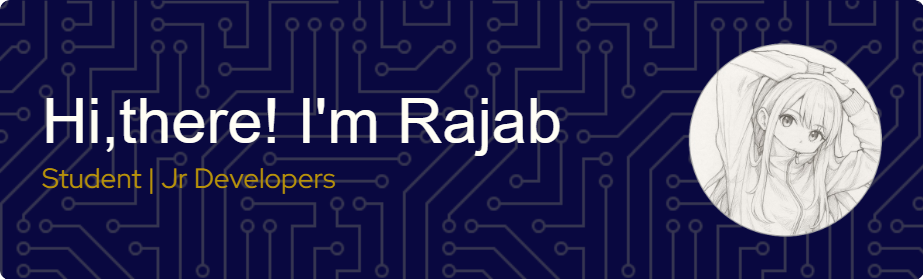

## Hello World! I'm Rajab 👋

<!--
**FelienZ/FelienZ** is a ✨ _special_ ✨ repository because its `README.md` (this file) appears on your GitHub profile.

Here are some ideas to get you started:

- 🔭 I’m currently working on ...
- 🌱 I’m currently learning ...
- 👯 I’m looking to collaborate on ...
- 🤔 I’m looking for help with ...
- 💬 Ask me about ...
- 📫 How to reach me: ...
- 😄 Pronouns: ...
- ⚡ Fun fact: ...
-->
🌱 Hi there! I'm currently learning *JavaScript* and diving into the world of web development. I'm focusing on building a strong foundation through small projects and daily practice.

- Current Focus:
  

- Plan to Learn:
  

🛠️ What I'm working on:

- Learning the basics of *JavaScript* (DOM, Web Storage, etc.)

- Writing simple apps to practice what I’ve learned

- Getting familiar with code structure and logic

🚀 My goals:

- Master *JavaScript* fundamentals

- Learn modern frameworks like **React** and **Node.js**

- Explore backend development with *Laravel* and other exciting technologies

<h2 align="left">My Experience</h2>

###

  
  
  
  
  
  
  
  
  
  
  
  
  
  
  

<h2 align="left">Let's Play</h2>

###

###

<picture>
  <source media="(prefers-color-scheme: dark)" srcset="https://raw.githubusercontent.com/FelienZ/FelienZ/output/pacman-contribution-graph-dark.svg">
  <source media="(prefers-color-scheme: light)" srcset="https://raw.githubusercontent.com/FelienZ/FelienZ/output/pacman-contribution-graph.svg">
  
</picture>

###

Thanks for stopping by! 😊 I hope to share more progress here as I grow in my journey
